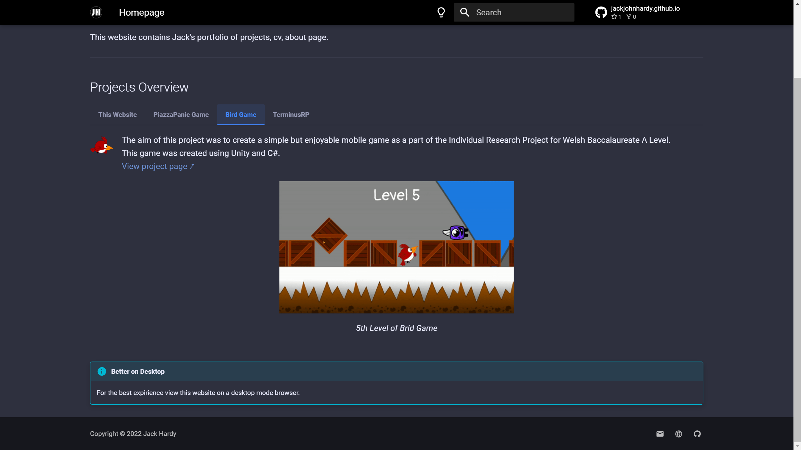
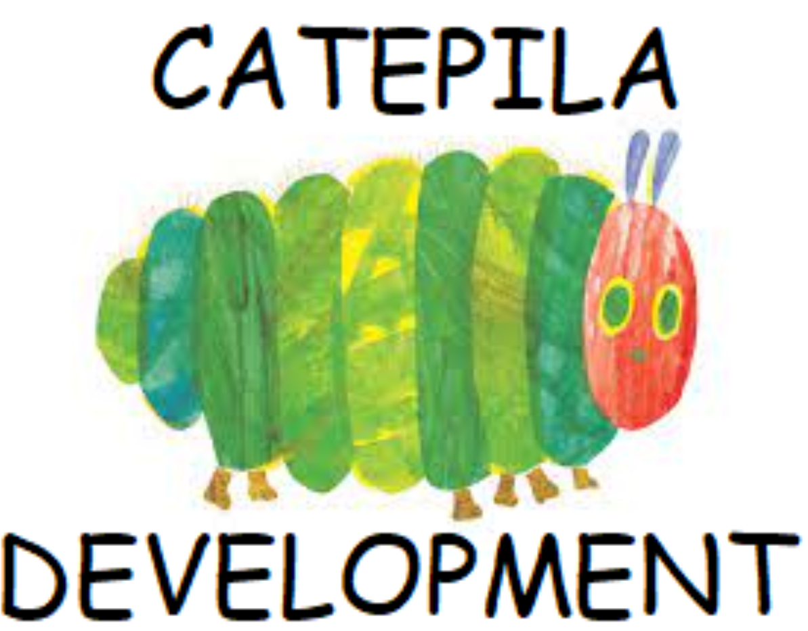
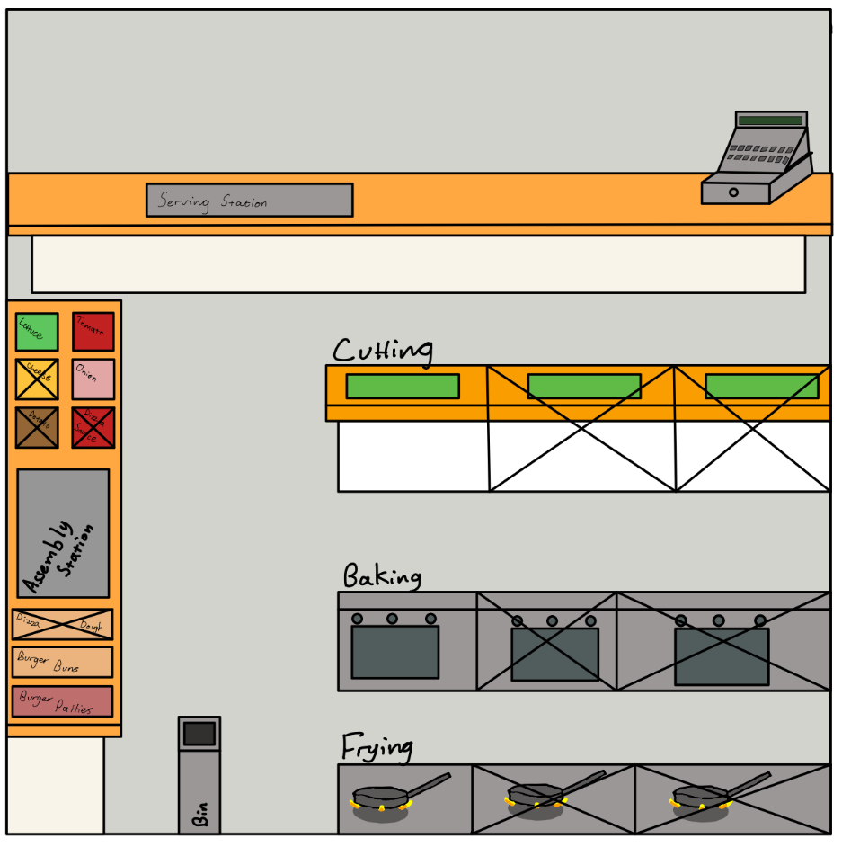
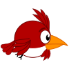

---
hide:
  - navigation
  - toc
  - footer
---

# Hi, I'm Jack. Welcome to my website!
This website contains my portfolio of projects, my CV, and an 'About Me' page.  

If you would like to get in touch, contact me at:  
:material-email: : [jackjohnhardy@outlook.com](mailto:jackjohnhardy@outlook.com)  
:material-phone: : 07932 696325  

---

# Projects Overview
=== "This Website"
    {align=left width=50}
    This project was to make the website you are viewing now.  
    [View project page ↗](website.md)

    <figure markdown>
        {width="500"}
        <figcaption>The Homepage of this Website</figcaption>
    </figure>

=== "PiazzaPanic"
    {align=left width=50}
    In this ongoing project, our team of 6 is creating a kitchen simulator game for presentation at open days for the University of York.  
    This game will be designed to the specification of our client from the university, and will be implemented in Java using the LibGDX library.  
    [View project page ↗](piazza_panic.md)  

    <figure markdown>
        {width="500"}
        <figcaption>An early mockup of the kitchen layout</figcaption>
    </figure>

=== "Bird Game"
    {align=left width=50}
    The aim of this project was to create a simple but enjoyable mobile game as a part of the Individual Research Project for Welsh Baccalaureate A Level.  
    This game was created using Unity and C#.  
    [View project page ↗](bird_game.md)

    <figure markdown>
        {width="500"}
        <figcaption>5th Level of Brid Game</figcaption>
    </figure>

=== "TerminusRP"
    {align=left width=50}
    This is an ongoing hobby project to create a DayZ Roleplay server and community.  
    The project includes several parts including:  

    * Creating a website for the project to include the guides, lore and server information.
    * Creating a DayZ server including the mod and server configuration, and custom world mapping.
    * Creating a DayZ mod with custom clothing, custom buildings, and custom items, and additional gameplay mechanics.
    * A Discord server for the community to recieve announcements and disucuss the server.
    * A custom Discord bot for integrating gameplay mechanics with the discord server such as economy, character, and roleplay mechanics. The bot is programmed in Java using the Java-Discord API.
    * Applying for monetisation permission from Bohemia Interactive to sell in-game cosmetics to support server costs.
    * Finding and using a rented dedicated server to host the DayZ server and Discord bot.

    [View project website ↗](https://www.terminusrp.com)
    <figure markdown>
        {width="500"}
        <figcaption>The TerminusRP Discord Bot</figcaption>
    </figure>

    <figure markdown>
        {width="500"}
        <figcaption>The Enforcer outfit from the Terminus RP Clothing Mod</figcaption>
    </figure>

    <figure markdown>
        {width="500"}
        <figcaption>Some custom mapping in early development</figcaption>
    </figure>

!!! info "Better on Desktop"
    For the best expirience view this website on a desktop mode browser.