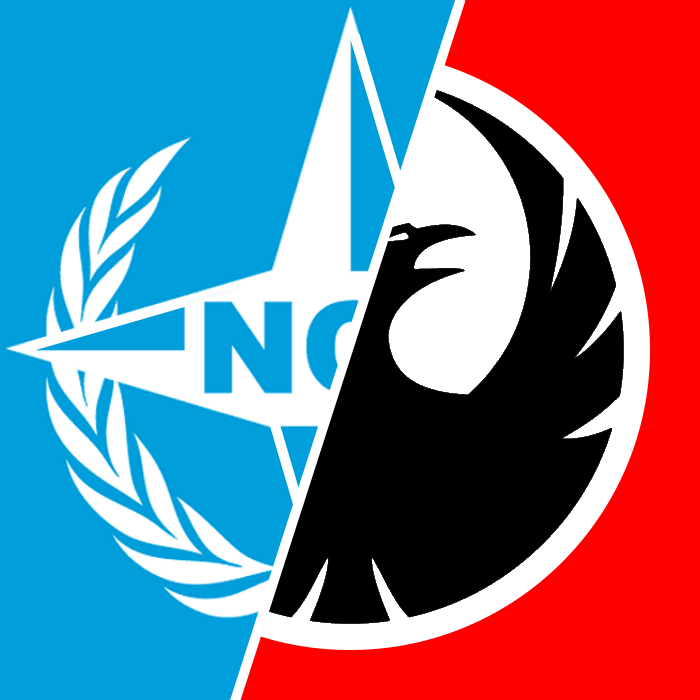
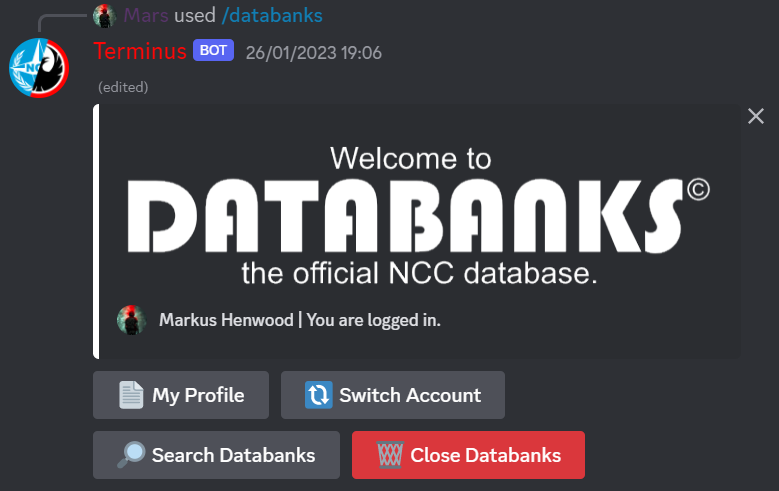

---
hide:
  - toc
  - footer
---

# TerminusRP
{align=left width=50}
This is an ongoing hobby project to create a DayZ Roleplay server and community.  
The project includes several parts including:  

* Creating a Website for the project to include the guides, lore and server information.
* Creating a DayZ server including the mod and server configuration, and custom world mapping.
* Creating a DayZ mod with custom clothing, custom buildings, and custom items, and additional gameplay mechanics.
* A Discord server for the community to recieve announcements and disucuss the server.
* A Custom Discord bot for integrating gameplay mechanics with the discord server such as economy, character, and roleplay mechanics. The bot is programmed in Java using the Java-Discord API.
* Applying for monetization permission to sell in-game cosmetics to support server costs.
* Finding and using a rented dedicated server to host the DayZ server and Discord Bot.

[View project website ↗](https://www.terminusrp.com)  
    <figure markdown>
        {width="500"}
        <figcaption>The TerminusRP Discord Bot</figcaption>
    </figure>
    <figure markdown>
        {width="500"}
        <figcaption>The Enforcer outfit from the Terminus RP Clothing Mod</figcaption>
    </figure>
    <figure markdown>
        {width="500"}
        <figcaption>Some custom mapping in early development</figcaption>
    </figure>

!!! info "Better on Desktop"
    For the best expirience view this website on a desktop mode browser.