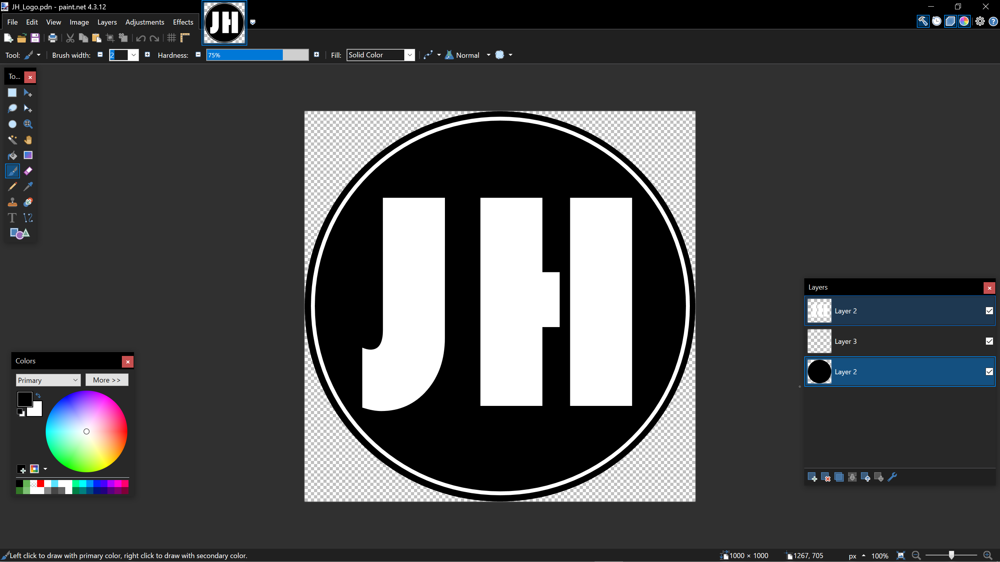
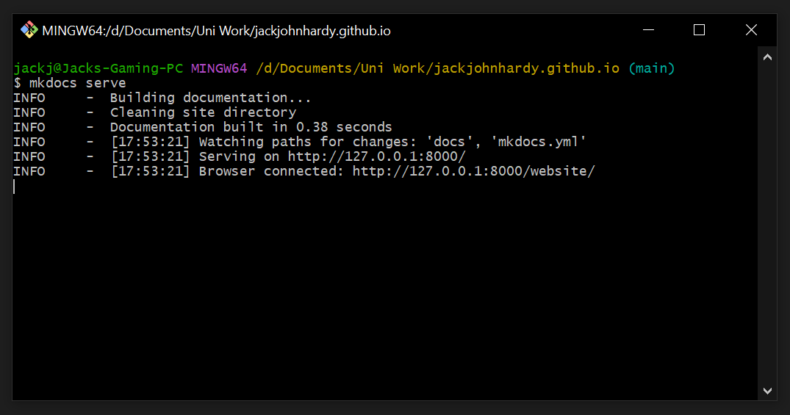
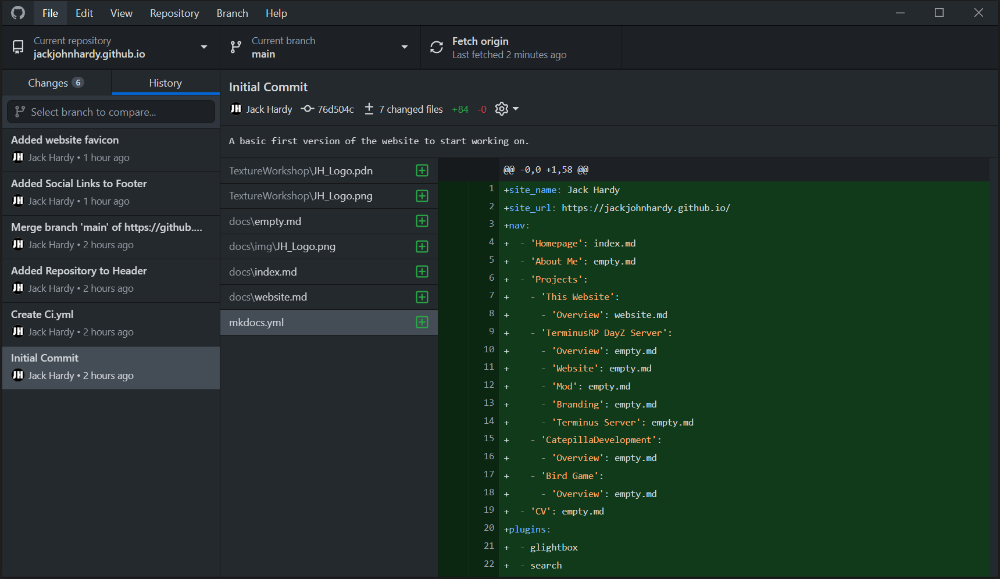
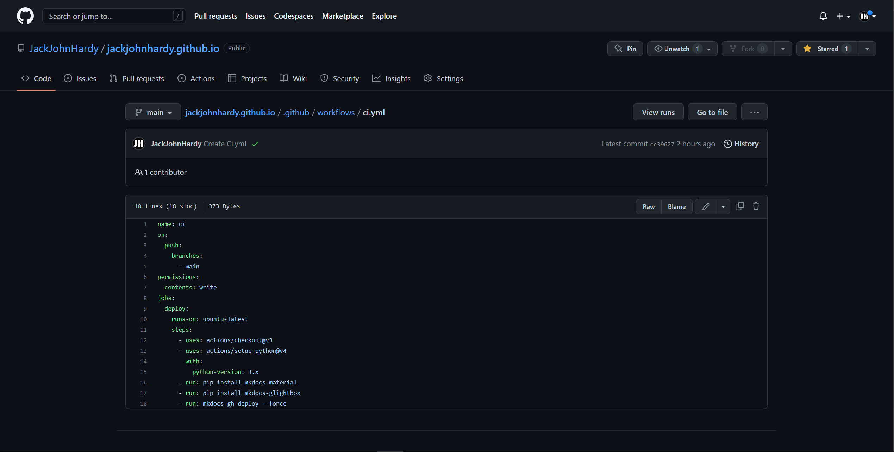
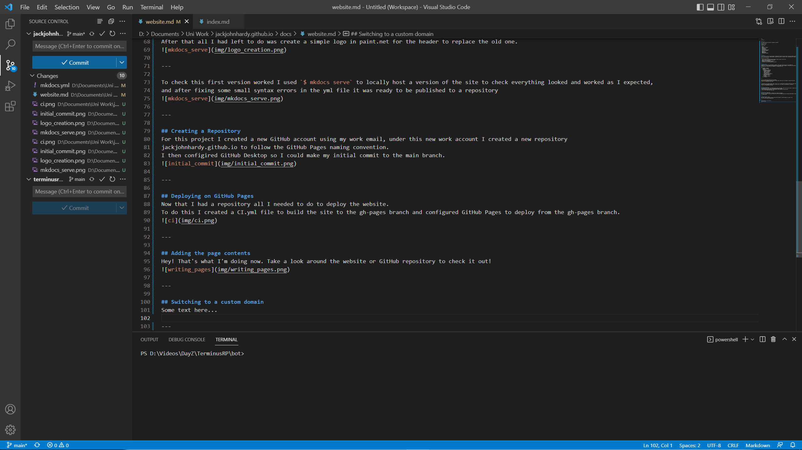
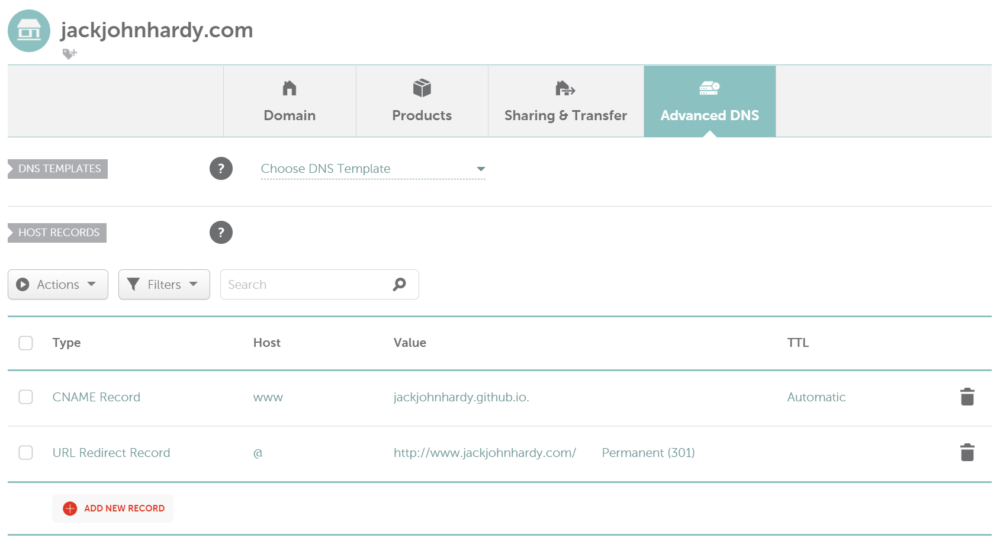

---
hide:
  - footer
---

## Overview
This page documents the process of making this website.  

Started: 23/12/22  
Completed: N/A

Project uses:  

- MkDocs
- Material for MkDocs
- GitHub.com
- GitHub Desktop
- GitHub Pages
- Continuous Integration
- Visual Studio Code
- Paint.net
- Namecheap.com
- CNAME Records
- URL Redirect Records

---

## Planning
As this is relatively simple project, I kept the planning process short so that I could get straight to writing about my projects.
I had already made a simple website a couple weeks earlier for another project using Material for Mkdocs, I decided to reuse what I had already built in that project.  

My plan for this project:  

- Copy and edit the TerminusRP website config for about, projects, and CV tabs
- Create a Guthub repository for the project
- Deploy using GitHub Pages
- Write out all the pages in markdown
- Switch to my own custom domain for the site

---

## Initial Version
To make the first version of the website, I created a local copy of my [TerminusRP website](terminusrp.md).  
Using this as a base, I removed the old markdown files, and made a simple homepage in index.md as a placeholder. 
Following this, I reworked the site navigation in the mkdocs.yml file.  
```
nav:
  - 'Homepage': index.md
  - 'About Me': empty.md
  - 'Projects':
    - 'My Website': website.md
    - 'TerminusRP DayZ Server':
      - 'Overview': empty.md
      - 'Website': empty.md
      - 'Mod': empty.md
      - 'Branding': empty.md
      - 'Terminus Server': empty.md
    - 'CatepillaDevelopment':
      - 'Overview': empty.md
    - 'Bird Game':
      - 'Overview': empty.md
  - 'CV': empty.md
```

---

{align=left width=50}
After that all I had left to do was create a simple logo in paint.net for the header to replace the old one.  


---

To check this first version worked I used `$ mkdocs serve` to locally host a version of the site to check everything looked and worked as I expected, 
and after fixing some small syntax errors in the yml file it was ready to be published to a repository.


---

## Creating a Repository
For this project I created a new GitHub account using my work email. Under this new work account I created a new repository 
jackjohnhardy.github.io to follow the GitHub Pages naming convention.  
I then configired GitHub Desktop so I could make my initial commit to the main branch.


---

## Deploying on GitHub Pages
Now that I had a repository all I needed to do to deploy the website.
To do this I created a CI.yml file to build the site to the gh-pages branch and configured GitHub Pages to deploy from the gh-pages branch.


---

## Adding the page contents
Hey! That's what I'm doing now. Take a look around the website or GitHub repository to check it out!


---

## Switching to a custom domain
To use my own domain for my GitHub Pages site, I purchased the domain jackjohnhardy.com from Namecheap.  
I then used Namecheaps advanced DNS to create a CNAME and a URL redirect records.


---